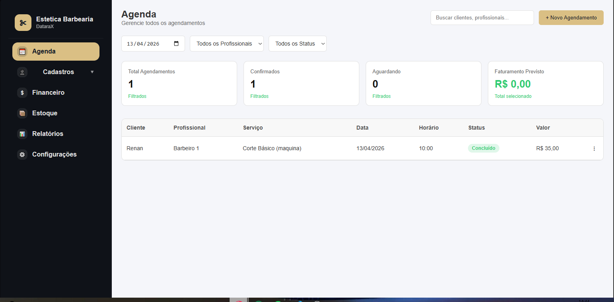
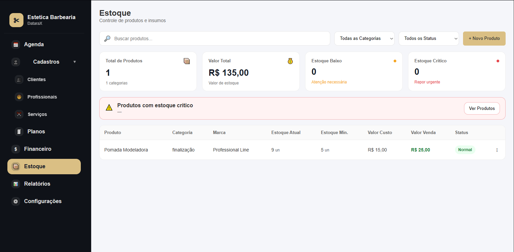
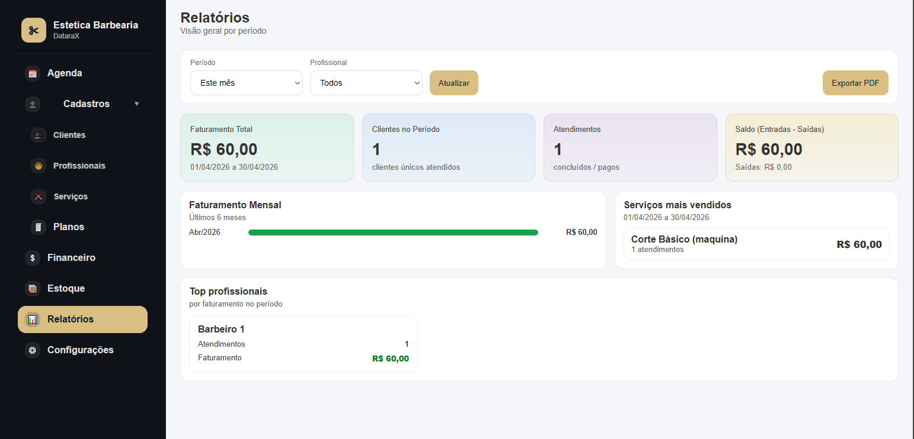

# Sistema de Gestão para Barbearia

Sistema desenvolvido para auxiliar na gestão de uma barbearia, reunindo em um só lugar o controle de agendamentos, clientes, profissionais, serviços, financeiro, comissões, estoque e relatórios.

## Funcionalidades

- Cadastro de clientes
- Cadastro de profissionais
- Cadastro de serviços
- Agendamentos
- Controle de status dos atendimentos
- Pagamento de agendamentos
- Controle de comissões
- Controle de estoque
- Relatórios operacionais e financeiros

## Demonstração






## Tecnologias utilizadas

- Python
- Flask
- SQLite
- HTML
- CSS
- JavaScript

## Objetivo do projeto

O objetivo do projeto é centralizar processos importantes da barbearia e facilitar o controle operacional e financeiro em uma única aplicação.

## Como executar o projeto

1. Clone este repositório:

```bash
git clone https://github.com/zRenanDiasz/gestao_barbearia_system.git
```
